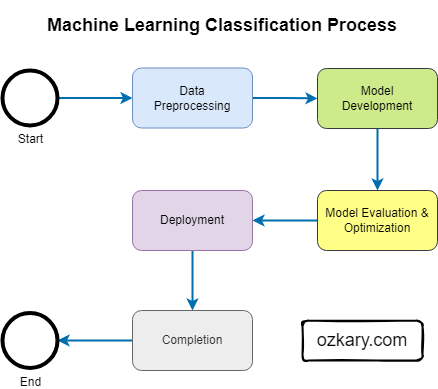

# Machine Learning (ML) Classification

Classification is a fundamental task in supervised machine learning where the goal is to predict the categorical class or label of a given data point based on its features. In other words, it involves assigning a predefined category to each input instance based on its characteristics.

## Key Components:

1. **Features (Predictors):**
   - These are the measurable characteristics or attributes of the data, often represented as variables. In a classification task for vehicles, features could include make, model, year, engine horsepower, etc.

2. **Target Variable (Class or Label):**
   - This is the variable we aim to predict or classify. It consists of discrete categories or labels, such as vehicle types (e.g., sedan, SUV, truck).

3. **Model:**
   - The machine learning algorithm or model learns patterns and relationships from the features to predict the target variable's class. Common models for classification include Logistic Regression, Decision Trees, Support Vector Machines, etc.

4. **Training:**
   - During the training phase, the model learns the patterns in the data by adjusting its parameters based on the features and known target labels.

5. **Testing and Evaluation:**
   - The model's performance is evaluated on a separate dataset (test set) to assess its ability to generalize to new, unseen data. Evaluation metrics like accuracy, precision, recall, and F1-score are used.

## Applications:
- Classification has a wide range of applications, including spam detection in emails, sentiment analysis in text, disease diagnosis in healthcare, credit risk assessment in finance, image recognition, and much more.

## Process Overview:

The steps in the classification process can be grouped into several distinct stages based on their related tasks and objectives. Here's a breakdown of the process into different stages:



### Stage 1: **Data Preprocessing**
   - Start
   - Data Preprocessing
     - Handle missing values
     - Perform feature engineering (if needed)
     - Encode categorical features
     - Split the data into training and testing sets

### Stage 2: **Model Development**
   - Model Selection
     - Choose an appropriate classification algorithm (e.g., Logistic Regression, Decision Trees, etc.)
   - Model Training
     - Train the selected model using the training set

### Stage 3: **Model Evaluation and Optimization**
   - Model Evaluation
     - Evaluate the model's performance using validation/testing data
     - Calculate evaluation metrics (accuracy, precision, recall, etc.)
   - Hyperparameter Tuning
     - Optimize the model's hyperparameters for better performance

### Stage 4: **Deployment**
   - Final Model
     - Select the final, optimized model
   - Model Deployment
     - Deploy the model for making predictions on new, unseen data

### Stage 5: **Completion**
   - End (Classification process is complete)

This grouping helps in organizing and understanding the workflow of the classification process more effectively. Each stage focuses on specific tasks related to data preparation, model development, evaluation, and deployment, contributing to the overall classification process.

Classification plays a vital role in various real-world scenarios, aiding in decision-making and providing valuable insights based on the analysis of different classes or categories.

## Use Case with Vehicle Data

### 1. **Understanding the Dataset:**
Start by exploring and understanding the dataset. Familiarize yourself with the features, their data types, distributions, and the target variable (in this case, the vehicle category we want to predict).

### 2. **Data Preprocessing:**
- **Handling Missing Values:** Check for missing or null values in the dataset and decide on a strategy to handle them, such as imputation or removal.
- **Feature Engineering:** Extract relevant features from the given ones and create any additional features that could enhance predictive performance.
- **Categorical Encoding:** Encode categorical features like "Make," "Model," and "Transmission Type" into numerical values using techniques like one-hot encoding or label encoding.
- **Data Split:** Split the dataset into training (60%), validation (20%), and testing (20%) sets.

### 3. **Model Selection:**
Choose an appropriate classification algorithm based on the problem. Here, we'll use Logistic Regression for classification.

### 4. **Model Training:**
- Fit the Logistic Regression model on the training dataset.

### 5. **Model Evaluation:**
- Evaluate the model's performance on the validation set using appropriate evaluation metrics for classification.

### 6. **Hyperparameter Tuning:**
- Optimize the model's hyperparameters to achieve better performance.

### 7. **Model Deployment:**
- Once you're satisfied with the model's performance, deploy it to make predictions on new, unseen data.

### Example Code (using Python and scikit-learn):

```python
import pandas as pd
from sklearn.model_selection import train_test_split
from sklearn.linear_model import LogisticRegression
from sklearn.metrics import accuracy_score, classification_report

# Load the dataset
data = pd.read_csv('vehicle_data.csv')

# Data preprocessing (handle missing values, feature engineering, categorical encoding)

# Split the dataset into features (X) and target (y)
X = data.drop('VehicleCategory', axis=1)  # Features
y = data['VehicleCategory']  # Target

# Split the data into training (60%), validation (20%), and testing (20%) sets
X_train, X_temp, y_train, y_temp = train_test_split(X, y, test_size=0.4, random_state=42)
X_val, X_test, y_val, y_test = train_test_split(X_temp, y_temp, test_size=0.5, random_state=42)

# Model selection and training
model = LogisticRegression(random_state=42)
model.fit(X_train, y_train)

# Model evaluation on the validation set
y_val_pred = model.predict(X_val)
val_accuracy = accuracy_score(y_val, y_val_pred)
print('Validation Accuracy:', val_accuracy)
print('Validation Classification Report:\n', classification_report(y_val, y_val_pred))

# Hyperparameter tuning (if needed)

# Model evaluation on the test set
y_test_pred = model.predict(X_test)
test_accuracy = accuracy_score(y_test, y_test_pred)
print('Test Accuracy:', test_accuracy)
print('Test Classification Report:\n', classification_report(y_test, y_test_pred))
```

This example uses Logistic Regression for the classification task and follows a 60%/20%/20% data split distribution. We train the model, evaluate it on the validation set, and then evaluate the final performance on the test set. Adjust the code and model based on your dataset and specific classification requirements.

## Use Case Summary

In the last code examples, we're performing a classification task using Logistic Regression, a commonly used algorithm for binary and multiclass classification.

### Goal of the Classification Task:

The goal of this classification task is to predict the category or class of vehicles based on their features. Each vehicle in the dataset has associated features such as make, model, year, engine HP, engine cylinders, etc. The target variable (what we want to predict) is the category of the vehicle, for instance, "sedan," "SUV," "truck," etc.

### Expected Result:

Given the features of a vehicle (e.g., make, model, year, etc.), the trained Logistic Regression model will predict the class or category to which the vehicle belongs. For example, if the features of a given vehicle correspond to those of an "SUV," the model should predict the class label as "SUV."

### Evaluation:

We split the data into training, validation, and test sets. We train the Logistic Regression model using the training set, validate its performance on the validation set, and then evaluate its final performance on the test set using evaluation metrics such as accuracy, precision, recall, and F1-score. These metrics will provide insights into how well the model can predict the correct vehicle categories.

### Practical Use:

In real-world applications, this classification model could be used by various stakeholders, such as dealerships, insurance companies, or consumers, to automatically categorize vehicles based on their features, aiding in inventory management, insurance assessments, or buying decisions.