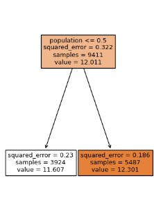

# Machine Learning (ML) Decision Trees and Ensemble Learning

### Decision Trees:

Decision trees are a versatile tool in machine learning for classification and regression tasks. They mimic human decision-making by creating a flowchart-like structure to make predictions based on input features. Decision tree regressors are particularly valuable for their simplicity, interpretability, and ability to handle both numerical and categorical features.

#### Purpose:
- Decision trees are intuitive and easy to interpret.
- They can handle both categorical and numerical data.
- Efficiently handles feature selection, requiring minimal data preparation.

#### Use Cases:

1. **Predictive Modeling:** Decision tree regressors are ideal for predictive modeling tasks where the goal is to predict numerical values, such as:
   - **Housing Price Prediction:** Determining the price of a house based on features like square footage, location, number of bedrooms, etc.
   - **Sales Forecasting:** Predicting future sales figures based on historical data, marketing activities, and external factors.
   - **Stock Price Prediction:** Estimating stock prices by analyzing historical trading data, economic indicators, and news sentiment.

2. **Resource Allocation:** Decision tree regressors can be used for optimizing resource allocation and decision-making, such as:
   - **Supply Chain Optimization:** Optimizing inventory levels, order quantities, and logistics to minimize costs while meeting demand.
   - **Resource Scheduling:** Allocating resources, such as personnel or equipment, to tasks to maximize efficiency and minimize delays.
   - **Energy Consumption Forecasting:** Predicting energy consumption patterns to optimize energy distribution and reduce costs.

3. **Risk Assessment:** Decision tree regressors are valuable for risk assessment and management in various domains:
   - **Credit Risk Analysis:** Evaluating the creditworthiness of individuals or businesses based on financial and demographic data.
   - **Insurance Pricing:** Setting insurance premiums by estimating the risk of policyholders' claims.
   - **Environmental Impact Assessment:** Predicting environmental impacts of projects and policies on air quality, water resources, and more.

4. **Anomaly Detection:** Decision tree regressors can identify unusual patterns or anomalies in data, which is crucial for applications like:
   - **Fraud Detection:** Detecting fraudulent transactions or activities in financial systems or online platforms.
   - **Quality Control:** Identifying defects in manufacturing processes and ensuring product quality.
   - **Network Intrusion Detection:** Detecting suspicious activities and security breaches in computer networks.

5. **Interpretable Models:** When interpretability is a priority, decision tree regressors are preferred. They provide insights into how decisions are made, making it easier to explain model predictions to stakeholders and end-users.

**Benefits:**
- Simplicity and interpretability.
- Handling of both numerical and categorical features.
- Robustness to outliers.
- Flexibility in choosing the depth of the tree.

**Considerations:**
- Prone to overfitting with deep trees.
- Limited in capturing complex relationships.
- Single decision trees may not be the most accurate models for all datasets.

In summary, the Decision Tree Regressor is a versatile model suitable for various regression tasks, especially when interpretability, resource allocation, or risk assessment is critical. However, it is essential to consider the potential for overfitting and explore ensemble methods like Random Forests or Gradient Boosting for improved predictive accuracy on complex datasets.


#### Python Example:
```python
# Import necessary libraries
# Import necessary libraries
import pandas as pd
from sklearn.model_selection import train_test_split
from sklearn.tree import DecisionTreeRegressor
from sklearn.feature_extraction import DictVectorizer

# Load the housing dataset
url = "https://raw.githubusercontent.com/ageron/handson-ml2/master/datasets/housing/housing.csv"
df = pd.read_csv(url)

# Data Preprocessing
# Fill missing values with zeros
df.fillna(0, inplace=True)

# Apply log transform to median_house_value
df['median_house_value'] = np.log1p(df['median_house_value'])

# Split the data into train/val/test sets with 60%/20%/20% distribution
df_full_train, df_test = train_test_split(df, test_size=0.2, random_state=1)
df_train, df_val = train_test_split(df_full_train, test_size=0.25, random_state=1)

# Separate the target variable from the train/val/test sets
y_train = df_train['median_house_value'].values
y_val = df_val['median_house_value'].values

# Create a DictVectorizer to transform data
dv = DictVectorizer(sparse=True)
train_dict = df_train.to_dict(orient='records')
X_train = dv.fit_transform(train_dict)

# Train a DecisionTreeRegressor model
dt_model = DecisionTreeRegressor()
dt_model.fit(X_train, y_train)

# Identify the feature used for splitting the data
feature_names = dv.get_feature_names_out(input_features=df_train.columns)
split_feature_idx = dt_model.tree_.feature[0]
split_feature = feature_names[split_feature_idx]

print(f"Feature used for splitting: {split_feature}")

```

#### Visualize a Decision Tree

```python

import matplotlib.pyplot as plt
from sklearn import tree
# Plot the decision tree
fig, ax = plt.subplots(figsize=(4, 6))
tree.plot_tree(model, feature_names=df_train.columns, filled=True, ax=ax)
plt.show()

```



- **Root Node**: The root node represents the entire dataset (samples) and predicts a value of 12.011 with a squared error of 0.322. The "population < 0.5" condition is used to make the initial split.

- **Branches**:
  1. **Left Branch**: This branch is formed by samples (3924) where the "population" feature is less than 0.5. The model predicts a value of 11.607 with a squared error of 0.23 for these samples.
  2. **Right Branch**: This branch is formed by samples (5487) where the "population" feature is greater than or equal to 0.5. The model predicts a value of 12.301 with a squared error of 0.186 for these samples.

In general, here's how you can interpret this:

1. **Root Node**: The root node represents the entire dataset and starts with a prediction of 12.011 for the target variable. This prediction is based on some initial criteria (likely other nodes higher up in the tree) that involve the "population" feature. The squared error is a measure of the model's uncertainty about this prediction.

2. **Branches**:
   - **Left Branch**: For the subset of samples where "population < 0.5," the model predicts a lower value (11.607) for the target variable. This suggests that for areas with lower population, the model believes the median house value is lower. The squared error indicates the variance in predictions within this group.
   - **Right Branch**: For the subset of samples where "population" is greater than or equal to 0.5, the model predicts a higher value (12.301) for the target variable. This suggests that for areas with a larger population, the model believes the median house value is higher. The squared error indicates the variance in predictions within this group.

Overall, the tree has split the dataset based on the "population" feature, with different predictions for different population levels. This is a simplified interpretation, as the tree can have many more levels and splits, and other features are likely involved in the decisions as well. It's a good practice to visualize the tree to get a more comprehensive view of its structure.


### Ensemble Learning (Random Forest):

Random Forest is an ensemble learning method that combines multiple decision trees to improve predictive performance and control overfitting.

#### Purpose:
- Provides higher accuracy and generalization by aggregating predictions from multiple trees.
- Reduces the risk of overfitting compared to a single decision tree.

#### Python Example (using Random Forest for credit risk analysis):
```python
# Import necessary libraries
from sklearn.ensemble import RandomForestClassifier
from sklearn.metrics import accuracy_score, classification_report

# Load your credit risk data and split into features (X) and labels (y)

# Split data into train and test sets
X_train, X_test, y_train, y_test = train_test_split(X, y, test_size=0.2, random_state=42)

# Create and train the Random Forest model
rf_model = RandomForestClassifier(random_state=42)
rf_model.fit(X_train, y_train)

# Predict using the model
y_pred_rf = rf_model.predict(X_test)

# Calculate accuracy
accuracy_rf = accuracy_score(y_test, y_pred_rf)
print(f"Accuracy (Random Forest): {accuracy_rf}")

# Additional evaluation (classification report)
print("Classification Report (Random Forest):")
print(classification_report(y_test, y_pred_rf))
```

In this example, we've used a Random Forest classifier for credit risk analysis. The model is trained on the training set and evaluated on the test set, providing accuracy and a detailed classification report.

Feel free to replace the dataset with your specific credit risk data and adapt the features and labels accordingly.

#### Estimators

In models like Random Forest, the term "estimators" refers to individual decision trees within the ensemble. Each estimator is a separate decision tree model that is trained on a subset of the data, using a random subset of features (known as feature bagging) to reduce overfitting and improve generalization.

The purpose of having multiple estimators in an ensemble, such as a Random Forest, is to improve the overall model's performance by aggregating the predictions from multiple individual models. 


1. **Reduction of Overfitting:** Using multiple estimators helps reduce the risk of overfitting, as each tree is trained on a different subset of the data. The ensemble model generalizes better to new, unseen data.

2. **Improved Robustness:** The ensemble can better handle noisy or biased data since individual estimators may make errors, but the aggregation of their predictions tends to be more robust.

3. **Enhanced Predictive Power:** Combining the predictions of multiple models can lead to a more accurate and stable model. The ensemble can capture complex patterns and relationships in the data that may be missed by individual trees.

4. **Feature Importance:** Random Forests can provide feature importance scores based on the contribution of each feature across different trees. This information can help identify which features are most influential in making predictions.

5. **Parallel Processing:** Since individual estimators (trees) can be trained independently, ensembles like Random Forest can take advantage of parallel processing, speeding up training and prediction.

Overall, the purpose of having multiple estimators in an ensemble is to create a more powerful and robust model that can make accurate predictions on a wide range of data by leveraging the collective wisdom of many individual models.

#### Depth Values

The purpose of using different `max_depth` values in decision tree models is to control the depth of the tree, which, in turn, influences the complexity of the model. Here's what each value of `max_depth` signifies and its impact on the model:

1. **Low Max Depth (Underfitting):** When you set a low value for `max_depth`, the decision tree will have a shallow structure. It means the tree makes simple decisions and doesn't capture intricate patterns in the data. Such trees tend to underfit the data, which means they have limited predictive power. They may generalize poorly to new, unseen data.

2. **Optimal Max Depth:** Choosing an appropriate `max_depth` value is essential. It balances the trade-off between capturing enough complexity in the data while avoiding overfitting. The optimal value depends on the specific dataset, and it may require experimentation to find the best value that minimizes the model's bias and variance.

3. **High Max Depth (Overfitting):** If you set a high value for `max_depth`, the tree becomes deep and can capture very fine-grained patterns in the data. While this can lead to great performance on the training data, it often results in overfitting, where the model becomes too specific to the training data and doesn't generalize well to new data.

In practice, you typically perform a hyperparameter search, trying different `max_depth` values to find the one that results in the best model performance on a validation dataset. The goal is to strike a balance between a model that is too simple (underfit) and a model that is too complex (overfit), aiming for the best generalization to new, unseen data.

The process of experimenting with different `max_depth` values is part of hyperparameter tuning, which is crucial for building machine learning models that perform well on a variety of datasets.

#### Most Important Feature

 The "most important feature" refers to the feature (or input variable) that has the greatest influence on the model's predictions. Specifically, in the case of a RandomForestRegressor or other ensemble methods like random forests, feature importance is a measure of how much each feature contributes to the model's ability to make accurate predictions.

Here's what it means when a feature is identified as the most important:

1. **Predictive Power:** The most important feature is the one that provides the most information to the model for making predictions. This feature has a strong influence on the model's ability to capture and explain variations in the target variable (in your case, house prices).

2. **Splitting Decision:** When building decision trees or random forests, at each split in the tree, the model decides which feature to use for the split. The most important feature is frequently selected for these splitting decisions. In other words, it is often the top choice for dividing the data into subsets that are more homogenous with respect to the target variable.

3. **High Feature Importance Score:** In scikit-learn, feature importance is typically quantified as a score. The most important feature has the highest score, indicating its significance in making predictions.

4. **Explanatory Power:** This feature can have a strong impact on the interpretability of your model. Knowing the most important feature allows you to better understand which factors are driving the model's predictions. For example, if the most important feature is "median income," it suggests that this variable plays a significant role in determining house prices.

5. **Model Understanding:** Identifying the most important feature can guide feature selection, help with model interpretation, and even lead to insights into the problem domain. It's a valuable tool for understanding what influences the target variable.

Remember that the importance of a feature can vary from one dataset to another and from one model to another. The feature importance metric provides a ranking of features based on their contribution to the model's performance. It is essential for feature selection and gaining insights into the relationships between features and the target variable in your dataset.

#### Extreme Gradient Boosting (XGBoost)

XGBoost (Extreme Gradient Boosting) is a powerful gradient boosting algorithm that is widely used in machine learning competitions and real-world applications. The primary purpose of using XGBoost and tuning the `eta` (learning rate) parameter is to improve the performance of your predictive model, specifically for regression tasks. Here's how it works:

1. **XGBoost**: XGBoost is an ensemble learning technique that combines the predictions of multiple decision trees to create a strong predictive model. It is particularly effective in handling structured data, tabular data, and regression problems. XGBoost is known for its speed, efficiency, and ability to handle large datasets.

2. **Learning Rate (`eta`)**: The learning rate, denoted as `eta`, is a crucial hyperparameter in gradient boosting algorithms like XGBoost. It controls the step size at each iteration while moving toward a minimum of a loss function. A smaller `eta` requires more iterations but may result in a better-optimized model.

   - A higher `eta` (e.g., 0.3) can lead to faster convergence but may overshoot the optimal solution.
   - A lower `eta` (e.g., 0.1) requires more iterations but is less likely to overshoot and might lead to better generalization.

The purpose of changing the `eta` parameter is to find the optimal balance between convergence speed and model accuracy. By experimenting with different `eta` values, you can:

- Discover the `eta` value that provides the best trade-off between training speed and model performance.
- Fine-tune the model to achieve better generalization on the validation dataset.
- Avoid overfitting (when the model performs well on the training data but poorly on unseen data) by finding an optimal `eta` that encourages the model to generalize well.

Tuning hyperparameters like `eta` is a crucial part of model optimization and helps you find the best configuration for your specific problem, leading to a more accurate and robust predictive model.

### What Model to Choose

The choice between Random Forest and XGBoost for predicting house values depends on several factors:

1. **Data Size:** If you have a large dataset, XGBoost often performs better. It's known for its efficiency and ability to handle large datasets effectively.

2. **Model Complexity:** XGBoost is a more complex model and can capture intricate relationships in the data. It's a good choice when you suspect that the target variable's relationship with the features is complex.

3. **Performance:** You should compare the performance of both models. Train and evaluate both Random Forest and XGBoost on your dataset to see which one produces better results in terms of metrics like RMSE (Root Mean Squared Error) or R-squared.

4. **Interpretability:** Random Forest models are generally easier to interpret compared to XGBoost. If model interpretability is essential for your use case, Random Forest might be a better choice.

5. **Feature Importance:** Both models can provide feature importance scores, but the way they calculate importance might differ. You can analyze feature importance scores to understand which features contribute the most to the predictions.

6. **Ensemble:** You can also consider using an ensemble of both models. Combining predictions from Random Forest and XGBoost can sometimes yield better results than either model alone.

In practice, it's common to experiment with different algorithms, including Random Forest and XGBoost, and compare their performance. You can use techniques like cross-validation to ensure that your evaluation is robust. The "best" model depends on your specific dataset and objectives.

For a thorough evaluation, you can also consider trying other regression algorithms such as Linear Regression, Lasso, Ridge, and Elastic Net. Each of these models has its strengths and weaknesses, and the best choice depends on the characteristics of your data and the goals of your analysis.

#### Cross Validation

Cross-validation is a technique used to assess the performance and generalization of a machine learning model. It involves splitting the dataset into multiple subsets (folds) and iteratively training and evaluating the model on different combinations of these subsets. One common method is k-fold cross-validation, where the data is divided into k equal-sized folds.

##### Random Forest Cross Validation

Here's how you can perform k-fold cross-validation using scikit-learn:

```python
from sklearn.model_selection import cross_val_score, KFold
from sklearn.ensemble import RandomForestRegressor

# Define your model
model = RandomForestRegressor(n_estimators=100, random_state=1)

# Define the number of folds (k)
k = 5

# Define a cross-validation method (k-fold in this case)
kf = KFold(n_splits=k, shuffle=True, random_state=1)

# Perform cross-validation and calculate RMSE (assuming you have your X and y)
scores = cross_val_score(model, X, y, cv=kf, scoring='neg_root_mean_squared_error')

# Negative RMSE scores are used to match the scikit-learn convention
# Convert them back to positive
rmse_scores = -scores

# Print the RMSE for each fold
for i, score in enumerate(rmse_scores):
    print(f'Fold {i+1} RMSE: {score:.4f}')

# Calculate the mean RMSE and its standard deviation
mean_rmse = rmse_scores.mean()
std_rmse = rmse_scores.std()

print(f'Mean RMSE: {mean_rmse:.4f}')
print(f'Standard Deviation of RMSE: {std_rmse:.4f}')
```

In this code:
- We define our machine learning model (in this case, a RandomForestRegressor), the number of folds (k), and create a KFold cross-validation object.
- We use the `cross_val_score` function to perform cross-validation. It returns negative RMSE scores by default, so we convert them back to positive RMSE values.
- We calculate the mean RMSE and its standard deviation across the folds.

This allows you to assess the model's performance more reliably than a single train-test split, and it can help you detect issues like overfitting or underfitting. You can adjust the value of `k` to control the number of folds.

##### XGBoost Cross Validation

Perform cross-validation for XGBoost in a similar way as you did for Random Forest. The general procedure is the same; you just need to make sure you're using XGBoost-specific functions and parameters.

Here's how you can do k-fold cross-validation with XGBoost using scikit-learn:

```python
import xgboost as xgb
from xgboost import DMatrix
from sklearn.model_selection import cross_val_score, KFold

# Define your XGBoost parameters
xgb_params = {
    'eta': 0.1,
    'max_depth': 6,
    'min_child_weight': 1,
    'objective': 'reg:squarederror',
    'nthread': 8,
    'seed': 1,
    'verbosity': 1
}

# Create a DMatrix for your data (assuming you have X_train and y_train)
data_dmatrix = DMatrix(data=X_train, label=y_train)

# Define the number of folds (k)
k = 5

# Define a cross-validation method (k-fold in this case)
kf = KFold(n_splits=k, shuffle=True, random_state=1)

# Perform cross-validation and calculate RMSE
xgb_model = xgb.train(params=xgb_params, dtrain=data_dmatrix, num_boost_round=100)

def rmse_scorer(model, X, y):
    y_pred = model.predict(X)
    return np.sqrt(np.mean((y_pred - y) ** 2))

# Use a custom scoring function to calculate RMSE
rmse_scores = cross_val_score(xgb_model, data_dmatrix, y_train, cv=kf, scoring=rmse_scorer)

# Print the RMSE for each fold
for i, score in enumerate(rmse_scores):
    print(f'Fold {i+1} RMSE: {score:.4f}')

# Calculate the mean RMSE and its standard deviation
mean_rmse = rmse_scores.mean()
std_rmse = rmse_scores.std()

print(f'Mean RMSE: {mean_rmse:.4f}')
print(f'Standard Deviation of RMSE: {std_rmse:.4f}')
```

In this code, you:
- Import the necessary XGBoost and scikit-learn libraries.
- Define your XGBoost parameters (you can adjust them as needed).
- Create a `DMatrix` for your data, which is a data structure used by XGBoost.
- Perform cross-validation using `cross_val_score` and a custom RMSE scoring function.
- Calculate the mean RMSE and its standard deviation.

This process helps you assess the performance of your XGBoost model through cross-validation, which is a common practice in machine learning model evaluation.

### Using the models

To make predictions using your trained models, you'll need to preprocess the input data (e.g., one-hot encoding categorical features and filling missing values) and then pass this preprocessed data to your models for prediction. Here's a step-by-step guide on how to do this using your Random Forest and XGBoost models:

1. Preprocess the Input Data: Ensure that the input data matches the format used for training your models. This typically involves performing the same data preprocessing steps you applied to your training data.

2. Load the Models: Load your trained Random Forest and XGBoost models. You can use the `RandomForestRegressor` and `XGBRegressor` classes from scikit-learn and XGBoost, respectively.

3. Prepare the Input Data: Prepare the input data (new house features) in the same format as your training data. Ensure that it has the same features and is one-hot encoded for categorical variables if necessary.

4. Make Predictions: Use the `predict` method of each model to make predictions. Here's an example of how to do it:

```python
   
# sample input record
sample_input = {
    'longitude': -118.21,
    'latitude': 34.05,
    'housing_median_age': 25,
    'total_rooms': 4300,
    'total_bedrooms': np.nan,  # Missing value
    'population': 1230,
    'households': 400,
    'median_income': 4.8,
    'ocean_proximity': 'INLAND'
}

# Create a DataFrame from the sample input
sample_df = pd.DataFrame([sample_input])

# Fill missing values (NaN) with zeros or other appropriate strategies
sample_df.fillna(0, inplace=True)

# Apply log(1+x) transformation to the target variable 
# sample_df['median_house_value'] = np.log1p(sample_df['median_house_value'])

# Convert the DataFrame to a dictionary for DictVectorizer
sample_dict = sample_df.to_dict(orient='records')

# Use DictVectorizer (dv) to transform the data into the required format
sample_encoded = dv.transform(sample_dict)

# Make predictions using the Random Forest and XGBoost models
rf_predictions = rf_model.predict(sample_encoded)
sample_encoded_matrix = xgb.DMatrix(sample_encoded)
xgb_predictions = xgb_model.predict(sample_encoded_matrix)

# Apply inverse log transformation to get the final predicted house prices
rf_predicted_price = np.expm1(rf_predictions)
xgb_predicted_price = np.expm1(xgb_predictions)

print("Random Forest Predicted Price:", rf_predicted_price[0])
print("XGBoost Predicted Price:", xgb_predicted_price[0])
```

5. Post-process Predictions: If your models were trained on log-transformed target values (e.g., using `log1p`), you should apply the inverse log transformation to obtain the final predicted house price.

6. Display or Use Predictions: You can display or use the predicted house prices as needed for your application.

Remember that the preprocessing and data format for input data must match what was used during model training to ensure accurate predictions. Additionally, some models may require specific transformations during prediction, such as inverse log transformation for regression models trained on log-transformed data.

## Summary

Decision trees and ensemble learning are fundamental concepts in machine learning, offering powerful tools to tackle complex problems and improve predictive accuracy. By understanding these concepts and their application, data scientists and machine learning practitioners can create robust models that generalize well and make informed predictions. Here are some key takeaways:

**1. Decision Trees:**
   - **Intuitive Decision-Making:** Decision trees are a visual representation of how a model makes decisions. They break down complex problems into a series of simpler, binary decisions.
   - **Feature Importance:** Decision trees can reveal the importance of each feature in making predictions. This insight is valuable for feature selection and understanding the underlying data.
   - **Limitations:** Decision trees can be prone to overfitting, where they perform well on training data but poorly on new data. They also don't always capture complex relationships.

**2. Ensemble Learning:**
   - **Improved Predictive Performance:** Ensemble learning combines multiple machine learning models to enhance overall performance. By aggregating the predictions of several models, it reduces the risk of overfitting and improves generalization.
   - **Bagging (Bootstrap Aggregating):** Techniques like Random Forests use bagging to create multiple decision trees, each trained on a different subset of data. This diversity results in better overall predictions.
   - **Boosting:** Boosting methods, such as AdaBoost and XGBoost, iteratively improve the model's predictions by giving more weight to misclassified samples, allowing the model to focus on challenging cases.
   - **Stacking:** Stacking combines the predictions of multiple base models with a meta-model to capture patterns that individual models may miss.

**3. Model Evaluation:**
   - **RMSE (Root Mean Square Error):** RMSE is a valuable metric for regression tasks, measuring the average error between actual and predicted values. Lower RMSE indicates better model performance.
   - **Feature Importance:** Decision tree-based models can provide insights into feature importance, guiding feature selection and data analysis.
   - **Cross-Validation:** Cross-validation helps assess model performance on various subsets of data, reducing the risk of overfitting.

**4. Hyperparameter Tuning:** The performance of decision tree and ensemble models can be fine-tuned by adjusting hyperparameters such as max depth, number of estimators, learning rate, etc.

**5. Preprocessing:** Data preprocessing steps like handling missing values, log transformations, and one-hot encoding are essential to prepare the data for modeling.

**6. Real-World Applications:** Decision trees and ensemble learning have diverse applications, including credit risk analysis, housing price prediction, fraud detection, recommendation systems, and more.

In conclusion, decision trees and ensemble learning are indispensable tools for machine learning practitioners. They provide an accessible framework for decision-making, reveal feature importance, and can be further optimized for performance. When combined with sound data preprocessing and feature engineering, they enable the development of robust predictive models for a wide range of real-world problems.

By understanding the principles and techniques discussed in our journey, machine learning professionals can make informed decisions and contribute to the development of accurate and reliable predictive models.
