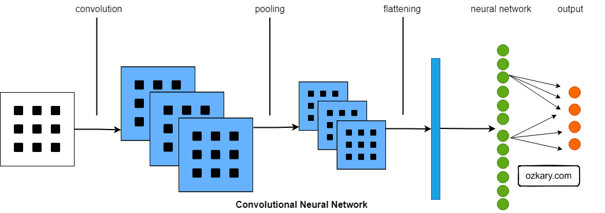
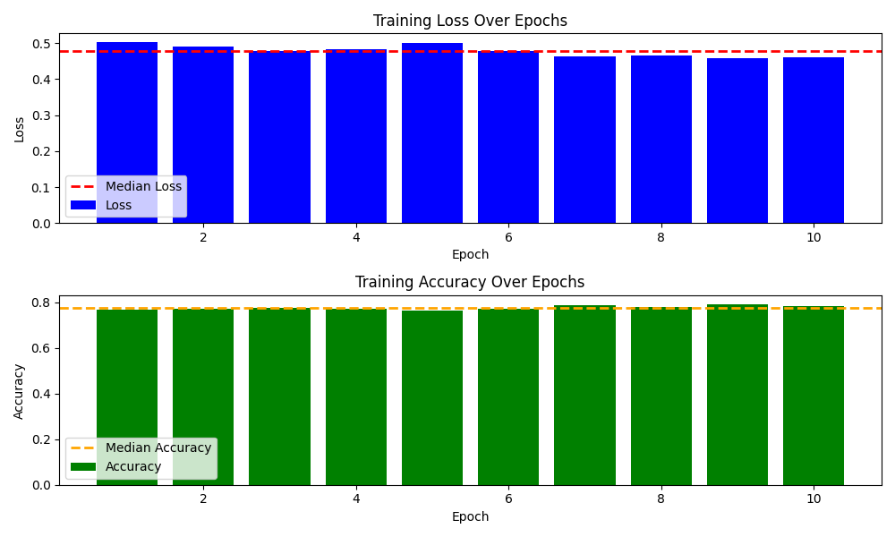

# Machine Learning - Deep Learning

## Deep Learning

Deep learning is a subfield of machine learning that focuses on training artificial neural networks to perform tasks without explicit programming. It involves learning hierarchical representations of data through multiple layers of interconnected nodes, known as neurons. These neural networks can automatically discover complex patterns and features in data, enabling them to excel in tasks such as image and speech recognition, natural language processing, and more. Deep learning has shown remarkable success in various domains, particularly with the advent of deep neural network architectures.


## Convolutional Neural Networks (CNNs)

Convolutional Neural Networks (CNNs) are a specialized class of deep neural networks designed for processing and analyzing grid-structured data, such as images and videos. CNNs are particularly powerful in computer vision tasks. They use convolutional layers to automatically and adaptively learn spatial hierarchies of features from input data. These networks employ filters or kernels to convolve across the input, capturing local patterns and gradually building complex representations. Pooling layers are often used to downsample the spatial dimensions, reducing computational complexity. CNNs have revolutionized image recognition, object detection, and various visual perception tasks.



[](https://youtu.be/OJjZGb7fmOo?si=TRxK13hoSJWdTy9r "Neural Network Model Analysis")

## Modeling

Let's review the layers in the provided Convolutional Neural Network (CNN) and discuss the importance of each layer:

```python
from keras.models import Sequential
from keras.layers import Conv2D, MaxPooling2D, Flatten, Dense
from keras.optimizers import SGD

def build_model():
    model = Sequential([
        # Convolutional layer
        Conv2D(32, (3, 3), activation='relu', input_shape=(150, 150, 3)),
        # MaxPooling layer
        MaxPooling2D(pool_size=(2, 2)),
        # Flatten layer
        Flatten(),
        # Dense layer with 64 neurons and 'relu' activation
        Dense(64, activation='relu'),
        # Output layer with 1 neuron and 'sigmoid' activation for binary classification
        Dense(1, activation='sigmoid')
    ])
  
    # Define the SGD optimizer with the specified parameters
    optimizer = SGD(learning_rate=0.002, momentum=0.8)

    # Compile the model with binary crossentropy loss and the defined optimizer
    model.compile(optimizer=optimizer, 
                 loss='binary_crossentropy', 
                 metrics=['accuracy'])

    # Print the model summary
    model.summary()

    return model
```

**1. Convolutional Layer:**
   - Importance: This layer extracts features from the input image using convolutional filters. It learns spatial hierarchies of patterns, capturing local features such as edges and textures.
   - Parameters:
     - 32 filters: Number of learned filters.
     - (3, 3) kernel: Size of the convolutional filter.
     - 'relu' activation: Introduces non-linearity to the model.
     - input_shape=(150, 150, 3): This parameter specifies the shape of the input data that will be fed into the model. In this case, it indicates that the input images should have a shape of (150, 150, 3), where:
         - 150 is the height of the image,
         - 150 is the width of the image, and
         - 3 represents the number of color channels (red, green, and blue).

**2. MaxPooling Layer:**
   - Importance: Reduces spatial dimensions, retaining the most important information. It helps in reducing computation and avoiding overfitting.
   - Parameters:
     - (2, 2) pool size: Downsamples the feature maps by taking the maximum value in each 2x2 region.

**3. Flatten Layer:**
   - Importance: Converts the multi-dimensional output of the previous layers into a one-dimensional vector. It prepares the data for the fully connected layers.
  
**4. Dense Layer (Hidden Layer):**
   - Importance: Learns complex patterns and combinations of features.
   - Parameters:
     - 64 neurons: Number of nodes in the layer.
     - 'relu' activation: Introduces non-linearity to the hidden layer.

**5. Output Layer:**
   - Importance: Produces the final output of the network.
   - Parameters:
     - 1 neuron: Binary classification requires a single output.
     - 'sigmoid' activation: Sigmoid is used for binary classification, producing values between 0 and 1.

**Overall:**
   - The Sequential model combines these layers to create a pipeline for feature extraction and classification.
   - SGD optimizer with specified parameters controls the model's learning during training.
   - Binary crossentropy is used as the loss function for binary classification tasks.
   - The model summary provides a detailed overview of the architecture, layer types, and parameter counts as shown below:

```bash
________________________________________________________________
 Layer (type)                Output Shape              Param #   
=================================================================
 conv2d_3 (Conv2D)           (None, 148, 148, 32)      896       
                                                              
 max_pooling2d_3 (MaxPoolin  (None, 74, 74, 32)        0         
 g2D) 

 flatten_3 (Flatten)         (None, 175232)            0         
                                                               
 dense_6 (Dense)             (None, 64)                11214912 

 dense_7 (Dense)             (None, 1)                 65        
=================================================================
Total params: 11215873 (42.79 MB)
Trainable params: 11215873 (42.79 MB)
Non-trainable params: 0 (0.00 Byte)

```

This CNN is a simple yet effective architecture for binary image classification tasks. It learns hierarchical features from input images, reducing spatial dimensions and finally classifying the input into one of two classes. Adjustments to architecture and hyperparameters may be necessary based on the specific problem and dataset.


## Generators and Model Training 

### Generators in Deep Learning

In deep learning, generators play a crucial role in efficiently loading and preprocessing data for model training. They allow for on-the-fly data augmentation, enabling the model to see diverse examples and improve its generalization. Generators are especially useful when working with large datasets that may not fit into memory.

```python

# Example of creating an augmented data generator for the training set
train_datagen = ImageDataGenerator(
    rescale=1./255,
    rotation_range=50,
    width_shift_range=0.1,
    height_shift_range=0.1,
    zoom_range=0.1,
    horizontal_flip=True,
    fill_mode='nearest'
)

# Use the get_data_gen function to get the augmented training data generator
train_dir = './train/directory'

# Set up the data generator for the training set
generator = train_datagen.flow_from_directory(
    path,
    target_size=(150, 150),
    batch_size=20,
    class_mode='binary',  # Use 'binary' for binary classification
    shuffle=True
)

```

This code is an example of creating an augmented data generator for the training set using the `ImageDataGenerator` class from Keras. It also shows how to use this generator to set up a data generator for a specified training directory.

**Parameters for `ImageDataGenerator` (train_datagen):**

1. **`rescale=1./255`**:
   - Rescales the pixel values of the images to the range [0, 1]. This is a common preprocessing step for neural networks.

2. **`rotation_range=50`**:
   - Specifies the range (in degrees) for random rotations. In this case, images may be rotated up to 50 degrees.

3. **`width_shift_range=0.1`**:
   - Controls the maximum fraction of total width by which the image can be horizontally shifted randomly. Here, it is set to 10% of the total width.

4. **`height_shift_range=0.1`**:
   - Controls the maximum fraction of total height by which the image can be vertically shifted randomly. Here, it is set to 10% of the total height.

5. **`zoom_range=0.1`**:
   - Controls the range for random zooming. Here, it allows zooming in or out by up to 10%.

6. **`horizontal_flip=True`**:
   - Enables random horizontal flipping of images. This helps increase the diversity of the training data.

7. **`fill_mode='nearest'`**:
   - Specifies the strategy for filling in newly created pixels during transformations. 'nearest' fills with the nearest existing pixel value.

**Parameters for `flow_from_directory` method:**

1. **`directory=train_dir`**:
   - Specifies the path to the training directory containing the class subdirectories.

2. **`target_size=(150, 150)`**:
   - Resizes the images to the specified target size. In this case, images are resized to 150x150 pixels.

3. **`batch_size=20`**:
   - Sets the number of images in each batch during training. Here, each batch will contain 20 images.

4. **`class_mode='binary'`**:
   - Indicates that the problem is a binary classification task. The generator will assign binary labels to the images.

5. **`shuffle=True`**:
   - Shuffles the order of the images in each epoch to introduce randomness during training.

In summary, this code sets up an augmented data generator for training by specifying various augmentation parameters using `ImageDataGenerator`. The `flow_from_directory` method then creates a generator for the specified training directory with additional settings such as target size, batch size, class mode, and shuffle. This generator can be used in model training to efficiently load and augment training data on-the-fly.

### Model Training

Model training involves optimizing the parameters of a neural network to minimize a specified loss function. During training, the model learns to map input data to the correct output by adjusting its weights and biases through backpropagation and optimization algorithms.

```python

history = model.fit(
    train_generator,
    epochs=10,
    validation_data=test_generator
)
```

The code uses the `fit` method to train a deep learning model (`model`) using a training data generator (`train_generator`) and validating it on a test data generator (`test_generator`). The training is performed for 10 epochs, and the `history` object is used to store and retrieve information about the training process.

**Explanation:**

1. **`model.fit`:**
   - The `fit` method is a fundamental method in Keras for training a model.
   - It takes the training data generator (`train_generator`) as input for the model to learn from.
   - The `epochs=10` parameter specifies the number of times the entire training dataset will be processed by the model during training.

2. **`validation_data=test_generator`:**
   - The `validation_data` parameter specifies the data generator used for validation during training. Here, it's set to the test data generator (`test_generator`).
   - The model evaluates its performance on this validation set after each epoch.

3. **`history`:**
   - The `fit` method returns a `History` object, which contains information about the training process.
   - The `history` object includes training and validation metrics for each epoch, such as training loss, training accuracy, validation loss, and validation accuracy.
   - It allows you to analyze and visualize the model's performance over time.

**Importance of the `history` Object:**

1. **Monitoring Model Progress:**
   - The `history` object is crucial for monitoring the progress of the model during training.
   - It provides insights into how the training and validation metrics change over epochs, helping you understand if the model is improving or overfitting.

2. **Visualization:**
   - You can use the information stored in the `history` object to create plots and visualizations. For example, plotting training and validation loss over epochs can help identify trends and make informed decisions about model training.

3. **Tuning Hyperparameters:**
   - By analyzing the `history` object, you can adjust hyperparameters such as learning rate or batch size to optimize the model's performance.

4. **Early Stopping:**
   - The `history` object is often used in conjunction with early stopping. If the validation metrics plateau or degrade, early stopping can be employed to halt training and prevent overfitting.

In summary, the `history` object is essential for tracking the training progress and evaluating model performance over epochs. It provides valuable information for making informed decisions during model development and tuning.

**Using Train and Test Generators with 10 Epochs:**

1. **Training and Test Data Generators:**
   - **Training Generator:** It is responsible for loading and augmenting the training data. Data augmentation techniques, such as rotation, shifting, and flipping, help the model generalize better to unseen examples.
   - **Test Generator:** It loads the test data without augmentation, providing a fair evaluation of the model's performance on unseen examples.

2. **Epochs:**
   - An epoch represents one complete pass through the entire training dataset. In the context of deep learning, it means the model has seen and learned from every example in the training set once.
   - Using 10 epochs means the model will iterate over the entire training dataset 10 times during training.

In summary, using train and test generators with 10 epochs is a standard practice in deep learning. It combines efficient data handling, augmentation for better generalization, and multiple iterations through the training data to achieve a well-trained model. The test set and the evaluation metrics ensure the model's ability to perform well on new, unseen data. Adjusting the number of epochs may be necessary based on the specific problem and dataset.

### Model Performance

When training a machine learning model, you typically monitor both the training metrics (such as training loss and training accuracy) and the validation metrics (val_loss and val_accuracy). These metrics provide insights into how well your model is learning from the training data and how well it generalizes to unseen data.

```bash
Epoch 1/10
184/184 [==============================] - 33s 179ms/step - loss: 0.5021 - accuracy: 0.7658 - val_loss: 0.5737 - val_accuracy: 0.7266
Epoch 2/10
184/184 [==============================] - 32s 172ms/step - loss: 0.4897 - accuracy: 0.7713 - val_loss: 0.5561 - val_accuracy: 0.7386
Epoch 3/10
184/184 [==============================] - 34s 184ms/step - loss: 0.4785 - accuracy: 0.7762 - val_loss: 0.4859 - val_accuracy: 0.7669
Epoch 4/10
184/184 [==============================] - 32s 173ms/step - loss: 0.4836 - accuracy: 0.7716 - val_loss: 0.4968 - val_accuracy: 0.7680
Epoch 5/10
184/184 [==============================] - 30s 161ms/step - loss: 0.4998 - accuracy: 0.7629 - val_loss: 0.4758 - val_accuracy: 0.7930
Epoch 6/10
184/184 [==============================] - 32s 173ms/step - loss: 0.4779 - accuracy: 0.7735 - val_loss: 0.4814 - val_accuracy: 0.7952
Epoch 7/10
184/184 [==============================] - 31s 167ms/step - loss: 0.4644 - accuracy: 0.7879 - val_loss: 0.4724 - val_accuracy: 0.7865
Epoch 8/10
184/184 [==============================] - 32s 173ms/step - loss: 0.4662 - accuracy: 0.7803 - val_loss: 0.4706 - val_accuracy: 0.7745
Epoch 9/10
184/184 [==============================] - 31s 171ms/step - loss: 0.4580 - accuracy: 0.7914 - val_loss: 0.4514 - val_accuracy: 0.7941
Epoch 10/10
184/184 [==============================] - 33s 181ms/step - loss: 0.4600 - accuracy: 0.7841 - val_loss: 0.4567 - val_accuracy: 0.7854

```

1. **Training Loss:**
   - Represents the error on the training data during each epoch.
   - It is the metric that the optimization algorithm is attempting to minimize.
   - Lower training loss indicates better fitting to the training data.

2. **Validation Loss (val_loss):**
   - Represents the error on a separate validation dataset (not seen during training).
   - It helps to monitor how well the model generalizes to new, unseen data.
   - An increase in validation loss may indicate overfitting (the model is fitting noise in the training data) or other issues.

3. **Training Accuracy:**
   - Represents the accuracy of the model on the training data.
   - It shows the proportion of correctly classified samples in the training set.
   - High training accuracy suggests that the model is fitting the training data well.

4. **Validation Accuracy (val_accuracy):**
   - Represents the accuracy of the model on a separate validation dataset.
   - Helps to evaluate how well the model generalizes to new, unseen data.
   - Monitoring validation accuracy is crucial to avoid overfitting.

In summary, we should focus on both training and validation metrics to assess our model's performance. While low training loss and high training accuracy are desired, it's equally important to ensure good performance on the validation set. If the training loss decreases, but the validation loss increases, it may indicate overfitting. Monitoring both sets of metrics helps you strike a balance between fitting the training data well and generalizing to new data.

**Median Loss and Accuracy:**

- The median loss is the middle value of the loss values across all epochs. It gives an idea of the central tendency of the model's performance.
- The median accuracy is the middle value of the accuracy values. It provides insight into the typical accuracy achieved by the model.

**Standard Deviation (std) of Loss and Accuracy:**

- The standard deviation of the loss values measures the spread or variability. A higher standard deviation might indicate fluctuating performance.

-The standard deviation of accuracy values reflects how much the accuracy varies across epochs. A lower standard deviation suggests more stable performance.

**Interpretation:**



- A decreasing trend in loss over epochs indicates that the model is improving its predictions.
- An increasing trend in accuracy over epochs indicates that the model is becoming more accurate in its classifications.

Analyzing the median and standard deviation helps understand the central tendency and variability in the model's performance. It's essential to visualize these trends, along with other metrics, to make informed decisions about model training and potential adjustments in hyperparameters.