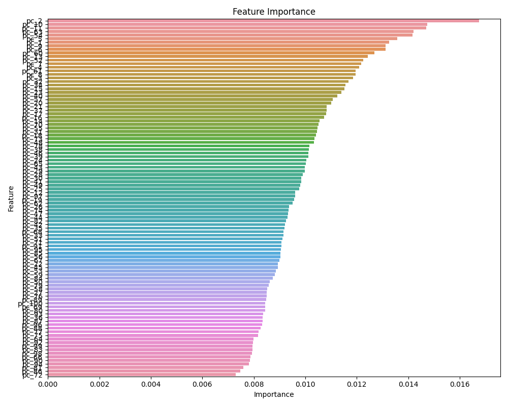

# Drug to Drug interaction - Machine Learning (ML) Classification

Can Machine Learning Unlock the Secrets of Drug-Drug Interactions (DDI)? 

Could Machine Learning (ML) be the key to unraveling and predicting these interactions? Join us on a journey to explore the abundance of medical drug information and investigate the feasibility of constructing predictive AI models that could revolutionize our ability to identify and anticipate drug-to-drug interactions.

## Problem Statement:

Drug-drug interactions (pharmacodynamics) occur when the chemical ingredients of different medications interact, potentially leading to various medical complications for patients. In the United States, the impact of these interactions is alarming, contributing to numerous health complications and even fatalities.

This study aims to address the pressing issue of DDI by leveraging data from DrugBank, a comprehensive repository documenting known drug interactions of 191,808 drug pairs. Our approach involves the utilization of machine learning models, trained on diverse attributes extracted from the drugs. Given the extensive nature of these attributes, we employ techniques such as the calculation of Structural Similarity Profile (SSP) vectors for each drug pair. 

The SSP vectors act as a calculated representation of the structural similarity between pairs of drugs. By capturing the structural (SMILES) nuances, the SSP vectors condense intricate chemical information into a concise yet informative form. This allows us to preserve the essence of drug interactions while reducing the dimensionality of the feature space.

Additionally, we utilize dimensionality reduction techniques, specifically Principal Component Analysis (PCA), to streamline the feature set and retain essential information. Through this innovative methodology, we aspire to enhance our understanding of drug interactions and contribute to the development of predictive models that can potentially mitigate the associated risks for patients.

**Key objectives of this research include:**

1. Developing a robust machine learning model capable of accurately predicting drug-drug interaction. which is a multi-class study.
2. Identifying the most influential risk factors and parameters contributing to these interactions.
3. Evaluate several models and compare their performance:   
   - Random Forest
   - XGBoost Classification
   - Decision Tree
   - Multi-Layer Perceptron Neural Network (MLP)
4. Evaluate these models metrics
   - Accuracy
   - Precision, 
   - F1 
   - Recall 
5. Providing an API, so tools can integrate and make a risk analysis.
   - Build a local app 
   - Build an Azure function for cloud deployment

> Since there are multiple possible drug-drug interactions, this is a multi-class target study

The successful implementation of this study has the potential to aid healthcare practices. By unraveling intricate patterns and predicting DDIs with accuracy, this research could pave the way for a transformative impact on public health. The outcomes may empower healthcare professionals to implement timely preventive measures and personalized interventions for individuals susceptible to adverse effects arising from drug interactions.

## Machine Learning Engineering Process

In order to execute this project, we follow a series of steps for discovery and data analysis, data processing and model selection. This process is done using jupyter notebooks for the experimental phase, and python files for the implementation and delivery phase.

### Experimental Phase Notebooks

- Data and feature analysis
  - [Step 1 - Data Analysis](./data_analysis.ipynb)  
- Train the model using different algorithm to evaluate the best option
  - [Step 2 - Model Training](./data_train.ipynb)
- Run test cases and predict results
  - [Step 3 - Model Prediction](./data_predict.ipynb)
- Call the Web Service
  - [Step 4 - API Call](./data_test_api.ipynb)

### Implementation and Delivery of the model

- Train and model selection
  - [Model Training](./data_train.py)
- Prediction and test cases
  - [Model Predict](./data_predict.py)
- Web service app
  - [Web Service ](./app.py)
- Azure Cloud Function
  - [Cloud Function](./fn-ai-ml-ddi/)

## Data Analysis - Exploratory Data Analysis (EDA)

These are the steps to analysis the data:

- Load the DrugBank data/pharma.7z
  - Extract the CSV file
  - Load the csv into a pandas dataframe
- Review the data   
  - Check the data types
  - Preview the data
    - Rename the columns to lowercase
- Identify the features
  - Rename the target feature
  - Identify the categorical and numeric features
  - Identify the target variables    
- Clean up the data
  - Remove null values
  - Remove duplicates  
- Load the drug information
  - Load drugbank look up information
  - Visualize the drug molecules
- Check the target values
  - Check the class balance in the data
  - Check the interaction types
- Feature Importance
  - Principal Component Analysis (PCA) features    
    - Importance analysis
  - Review Structural Similarity Profile (SSP) for drug pairs  
    - Get the SMILE code for all the drugs
      - Calculate the SSP 
    - Importance analysis

### Feature Analysis

Based on the dataset, we have a mix of categorical and numerical features. We consider the following for processing:

1. **Target Variable:**
   - The target variable is categorical and has 86 possible types (multi-class).
   - Each type likely represents a specific category or class related to drug interactions.

2. **Features:**
   - **Numeric Features (PCA Columns):**
     - These are the numeric features represented by the PCA columns (pc_1 to pc_100).
     - 'pc_1' to 'pc_50' are associated with 'drug1'. 'pc_51' to 'pc_100' are associated with 'drug2'
     - These columns seem to be the Principal Components obtained through Principal Component Analysis (PCA).    

   - **Categorical Features (Drug SMILE Codes):**
     - There are four categorical features: 'drug1_id', 'drug1', 'drug2_id', and 'drug2'.
     - The drug1_id and drug2_id are the drug identifiers and can be removed from the analysis.
     - The drug1 and drug2 columns contain SMILE codes, which are textual representations of molecular structures.
     - These need to be encoded using Structural Similarity Profile (SSP).
       - This feature might capture the similarity or dissimilarity between the molecular structures of drug pairs.

### Data Validation and Class Balance

The data shows that the target variable is a categorical feature already in numeric values for lookup purposes. The distribution of these values are shown in the following bar and pie charts.


There are multiple target categories. There is a class imbalance as shown below:


> DDI Categories 49, 47 and 73 make up 62% of the DDI cases.

### Feature Importance

After evaluating the significance of the pc_n features, we observed a low association between these features and the target variable.



Upon evaluating the molecular similarities of drugs, we identified a robust association, as indicated by the feature importance:

`Feature Importance for SSP: [1]`

Consequently, for our model evaluation, we have decided to utilize the SSP feature.

## Machine Learning Training and Model Selection

- Load the ./data/ssp_interaction_type.csv.gz
- Process the features
  - Set the categorical features names
  - Set the numeric features names  
  - Set the target variable
- Split the data
  - train/validation/test split with 60%/20%/20% distribution.
  - Random_state 42
- Encode the data
  - Encode the categorical and numerical feature using DictVectorizer
  - Encode the target variable to make it numerical continuous from 0-n
- Train the model
  - LogisticRegression
  - RandomForestClassifier
  - XGBClassifier
  - DecisionTreeClassifier
- Fine tune hyperparameters
- Evaluate the models and compare them
  - accuracy_score
  - precision_score
  - recall_score
  - f1_score
- Export the code to ddi_lib
  - data_train.py

### Data Split

- Use a 60/20/20 distribution for train/val/test
- Random_state 42 to shuffle the data

### Model Evaluation

Use these models with the following hyper-parameters:

```python
random_state=42
'random_forest': RandomForestClassifier(n_estimators=100, max_depth=5, random_state=random_state, n_jobs=-1),
'xgboost': XGBClassifier(n_estimators=100, max_depth=5, random_state=42, n_jobs=-1),                
'decision_tree': DecisionTreeClassifier(max_depth=5, random_state=random_state)
```

#### Results:

After training the models with the same data, we evaluate each one of them with the following results:

|   Model         | Accuracy | Precision | Recall | F1      |
|------------------|----------|-----------|--------|---------|
| Random Forest    | 0.436474 | 0.031082  | 0.02932| 0.025582|
| XGBoost          | 0.883765 | 0.843175  | 0.768203| 0.794142|
| Decision Tree    | 0.421381 | 0.070120  | 0.046643| 0.046055|


#### Analysis:

Let's break down the analysis for each model and metrics:

#### Random Forest
- **Accuracy:** 43.65%
- **Precision:** 3.11%
- **Recall:** 2.93%
- **F1 Score:** 2.56%

#### XGBoost
- **Accuracy:** 88.38%
- **Precision:** 84.32%
- **Recall:** 76.82%
- **F1 Score:** 79.41%

#### Decision Tree
- **Accuracy:** 42.14%
- **Precision:** 7.01%
- **Recall:** 4.66%
- **F1 Score:** 4.61%

#### Observations

- XGBoost outperforms both Random Forest and Decision Tree in all metrics, showing significantly higher accuracy, precision, recall, and F1 score.
- Random Forest and Decision Tree models exhibit relatively lower performance compared to XGBoost, especially in terms of precision, recall, and F1 score.
- The choice of the appropriate model is crucial, and in this case, XGBoost seems to be the most suitable for the given classification task.

Further investigation, including potential data imbalances and feature relevance, is recommended. Model tuning and additional feature engineering might be necessary to enhance performance.

#### Model Evaluation with Hyperparameter Adjustments

To improve the model performance, we make the following hyperparameter changes:

```python
# fine tune the model hyperparameters
model_factory.train(X_train_std, y_train_encoded, reset=True, estimators=150, depth=7)
```

**Results:**

|   Model         | Accuracy | Precision | Recall  | F1      |
|------------------|----------|-----------|---------|---------|
| Random Forest    | 0.440697 | 0.031069  | 0.029685| 0.025856|
| XGBoost          | 0.914968 | 0.872246  | 0.777030| 0.808129|
| Decision Tree    | 0.483916 | 0.143749  | 0.075598| 0.077136|

The hyperparameter changes did not result in a significant improvement for the random_forest and decision_tree models, but it did improve the xgboost model. 


### Conclusion: Model Evaluation

After evaluating the performance of different models on our dataset, it is evident that XGBoost outperforms both Random Forest and Decision Tree models across various metrics. The high accuracy (91.5%) and robustness in precision, recall, and F1 score make XGBoost the preferred choice for predicting drug-drug interactions in our analysis.

Next, we will evaluate a neural network to explore further enhancements.

## Neural Network Evaluation

In the context of drug interaction prediction task for DDI analysis, a simple feed forward neural network (also known as a dense or multi-layer perceptron network MLP) is suitable. We can use dense layers (Dense in Keras) to connect each neuron in one layer to each neuron in the next layer. 

For this analysis, we will evaluate three different networks. Starting from a simple architecture and improving it by adding more layers.

- Load the ./data/ssp_interaction_type.csv.gz
- Process the features
  - Set the categorical features names
  - Set the numeric features names  
  - Set the target variable
- Split the data
  - train/validation/test split with 60%/20%/20% distribution.
  - Random_state 42
- Encode the data
  - Encode the categorical and numerical feature using DictVectorizer
  - Encode the target variable to make it numerical continuous from 0-n
- Train the MLP models (12 epochs)
  - Model 1
  - Model 2
  - Model 3  
- Evaluate the models and compare them
  - accuracy_score
  - precision_score
  - recall_score
  - f1_score
- Confusion Matrix
- Export the code to ddi_lib
  - data_train_mlp.py

### Data Split

- Use a 60/20/20 distribution for train/val/test
- Random_state 42 to shuffle the data

### Model Architecture

The following model architectures are evaluated for this study:

#### MLP Model 1


#### MLP Model 2


#### MLP Model 3


### Model Evaluation

| Model   | Accuracy | Validation Accuracy | Loss  | Loss Accuracy |
|---------|----------|----------------------|-------|---------------|
| Model 1 | 0.6637   | 0.7206               | 1.0069| 0.8541        |
| Model 2 | 0.7191   | 0.7893               | 0.8481| 0.6391        |
| Model 3 | 0.8768   | 0.8581               | 0.3896| 0.4623        |


This is a breakdown analysis for each model:

**Model 1:**
- **Accuracy:** 66.37%
- **Validation Accuracy:** 72.06%
- **Loss:** 1.0069
- **Loss Accuracy:** 85.41%

**Model 2:**
- **Accuracy:** 71.91%
- **Validation Accuracy:** 78.93%
- **Loss:** 0.8481
- **Loss Accuracy:** 63.91%

**Model 3:**
- **Accuracy:** 87.68%
- **Validation Accuracy:** 85.81%
- **Loss:** 0.3896
- **Loss Accuracy:** 46.23%

**Analysis:**
- Model 3 outperforms the other models in terms of both accuracy and validation accuracy.
- Model 2 shows significant improvement compared to Model 1, with higher accuracy and lower loss.
- Model 3 has the lowest loss value, indicating better convergence during training.
- Validation accuracy is close to the training accuracy for all models, suggesting reasonable generalization.

**Conclusion:**

Model 3 consistently outperforms the other models across all metrics, exhibiting the highest accuracy and validation accuracy while having the lowest loss and loss accuracy. Therefore, Model 3 is recommended for further testing and prediction tasks.

## Model Predictions

We are using the XGBoost model for our predictions.

