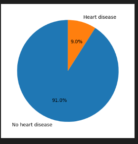
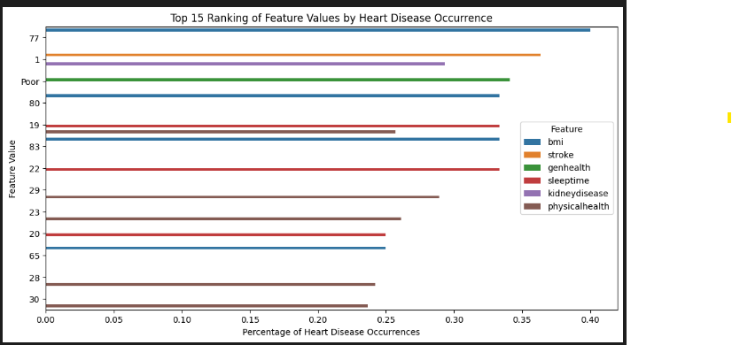
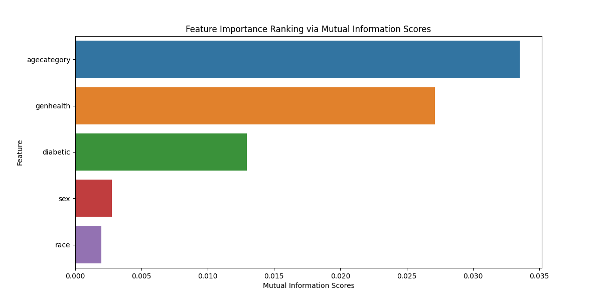
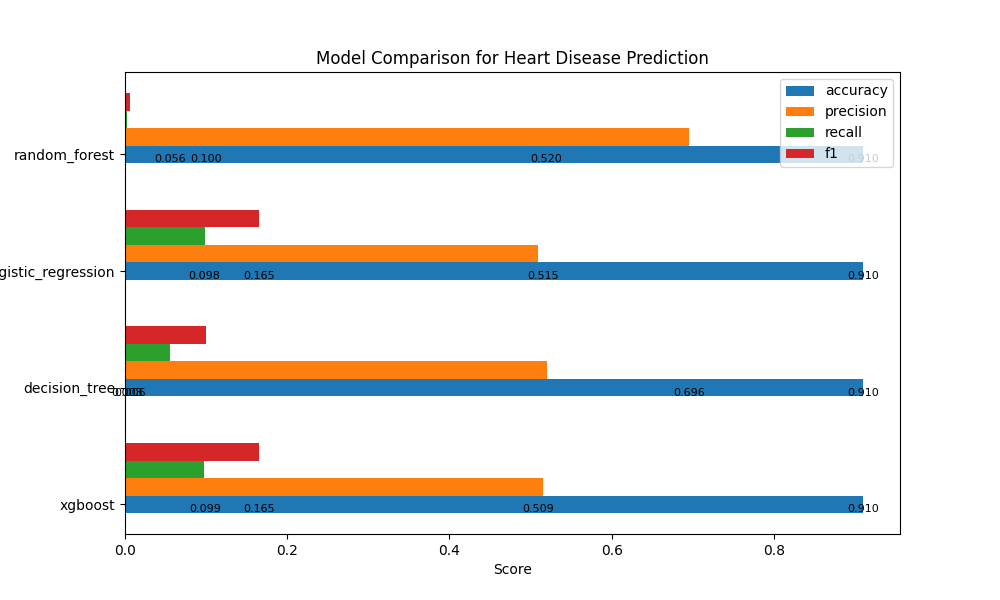
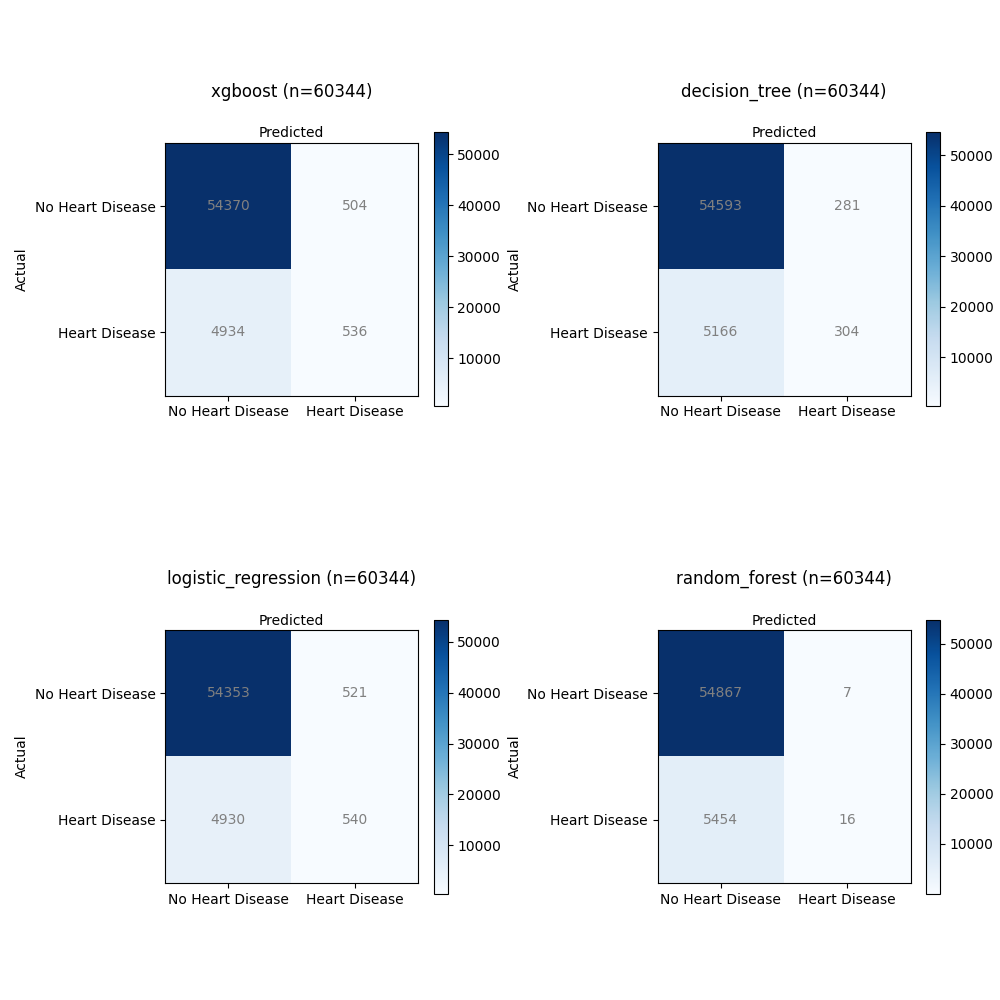

# Heart Disease Risk - Machine Learning (ML) Classification

## Problem Statement:
Heart disease is a leading cause of mortality worldwide, and its early identification and risk assessment are critical for effective prevention and intervention. With the help of electronic health records (EHR) and a wealth of health-related data, there is a significant opportunity to leverage machine learning techniques for predicting and assessing the risk of heart disease in individuals.

The United States Centers for Disease Control and Prevention (CDC) has been collecting a vast array of data on demographics, lifestyle, medical history, and clinical parameters. This data repository offers a valuable resource to develop predictive models that can help identify those at risk of heart disease before symptoms manifest.

This study aims to use machine learning models to predict an individual's likelihood of developing heart disease based on CDC data. By employing advanced algorithms and data analysis, we seek to create a predictive model that factors in various attributes such as age, gender, cholesterol levels, blood pressure, smoking habits, and other relevant health indicators. The solution could assist healthcare professionals in evaluating an individual's risk profile for heart disease.

Key objectives of this research include:

1. Developing a robust machine learning model capable of accurately predicting the risk of heart disease using CDC data.
2. Identifying the most influential risk factors and parameters contributing to heart disease prediction.
4. Compare model performance:
   - Logistic Regression
   - Decision Tree
   - Random Forest
   - XGBoost Classification
3. Evaluating the following metrics
   - Accuracy
   - Precision, 
   - F1 
   - Recall 
4. Providing an API, so tools can integrate and make a risk analysis.

The successful implementation of this research will lead to a transformative impact on public health by enabling timely preventive measures and tailored interventions for individuals at risk of heart disease.

## Machine Learning Engineering Process

In order to execute this project, we follow a series of steps for discovery and data analysis, data processing and model selection. This process is done using jupyter notebooks for the experimental phase, and python files for the implementation and delivery phase.

### Experimental Phase Notebooks

- Data analysis and cleanup 
  - [Step 1 - Data Analysis](./data_analysis.ipynb)  
- Process and convert the data for modeling, feature analysis
  - [Step 2 - Data Processing](./data_processing.ipynb)
- Train the model using different algorithm to evaluate the best option
  - [Step 3 - Model Processing](./data_train.ipynb)
- Run test cases and predict results
  - [Step 4 - Model Prediction](./data_predict.ipynb)
- Call the Web Service
  - [Step 5 - API Call](./data_test_api.ipynb)


### Implementation and Delivery of the model

- Train and model selection
  - [Model Training](./data_train.py)
- Prediction and test cases
  - [Model Predict](./data_predict.py)
- Web service app
  - [Web Service ](./app.py)

## Data Analysis - Exploratory Data Analysis (EDA)

These are the steps to analysis the data:

- Load the data/2020/heart_2020_cleaned.csv
- Fill in the missing values with zero
- Review the data 
  - Rename the columns to lowercase
  - Check the data types
  - Preview the data
- Identify the features
  - Identify the categorical and numeric features
  - Identify the target variables    
- Remove duplicates
- Identify categorical features that can be converted into binary
- Check the class balance in the data
  - Check for Y/N labels for heart disease identification

### Features

Based on the dataset, we have a mix of categorical and numerical features. We consider the following for encoding:

1. **Categorical Features:**
   - 'heartdisease': This is your target variable, and you mentioned that you want to predict a rank instead of binary outcomes. You can leave this as is since it represents the outcome.
   - 'smoking', 'alcoholdrinking', 'stroke', 'sex', 'agecategory', 'race', 'diabetic', 'physicalactivity', 'genhealth', 'sleeptime', 'asthma', 'kidneydisease', 'skincancer': These are categorical features. You can consider one-hot encoding these features.
   
2. **Numerical Features:**
   - 'bmi', 'physicalhealth', 'mentalhealth', 'diffwalking': These are already numerical features, so there's no need to encode them.


### Data Validation and Class Balance

The data shows imbalance for the Y/N classes. There are less cases of heart disease, as expected, than the rest of the population. This can result in low performing models as there is way more negatives cases (N). To account for that, we can use techniques like down sampling the negative cases.

#### Heart Disease Distribution

> No 91% Yes 9%




## Data Processing

For data processing, we should follow these steps:

- Load the data/2020/heart_2020_eda.csv
- Process the values
  - Convert Yes/No features to binary (1/0)
  - Cast all the numeric values to int to avoid float problems
- Process the features
  - Set the categorical features names
  - Set the numeric features names  
  - Set the target variable
- Feature importance analysis
 - Use statistical analysis to get the metrics like risk and ratio
 - Mutual Information score

#### Feature Analysis

The purpose of feature analysis in heart disease research is to uncover the relationships and associations between various patient characteristics (features) and the occurrence of heart disease. By examining factors such as lifestyle, medical history, demographics, and more, we aim to identify which specific attributes or combinations of attributes are most strongly correlated with heart disease. Feature analysis allows for the discovery of risk factors and insights that can inform prevention and early detection strategies. 

```bash

Overall Rate 0.09035
           Feature Value  Percentage  Difference     Ratio      Risk
65             bmi    77    0.400000    0.309647  3.427086  4.427086
1           stroke     1    0.363810    0.273457  3.026542  4.026542
3        genhealth  Poor    0.341131    0.250778  2.775537  3.775537
68             bmi    80    0.333333    0.242980  2.689239  3.689239
18       sleeptime    19    0.333333    0.242980  2.689239  3.689239
71             bmi    83    0.333333    0.242980  2.689239  3.689239
21       sleeptime    22    0.333333    0.242980  2.689239  3.689239
1    kidneydisease     1    0.293308    0.202956  2.246254  3.246254
29  physicalhealth    29    0.289216    0.198863  2.200957  3.200957

```



1. `Overall Rate`: This is the overall rate of heart disease occurrence in the  dataset. It represents the proportion of individuals with heart disease (target='Yes') in the  dataset. For example, if the overall rate is 0.2, it means that 20% of the individuals in the  dataset have heart disease.

2. `Difference`: This value represents the difference between the percentage of heart disease occurrence for a specific feature value and the overall rate. It tells you how much more or less likely individuals with a particular feature value are to have heart disease compared to the overall population. A positive difference indicates a higher likelihood, while a negative difference indicates a lower likelihood.

3. `Ratio`: The ratio represents the difference relative to the overall rate. It quantifies how much the heart disease occurrence for a specific feature value deviates from the overall rate, considering the overall rate as the baseline. A ratio greater than 1 indicates a higher risk compared to the overall population, while a ratio less than 1 indicates a lower risk.

4. `Risk`: This metric directly quantifies the likelihood of an event happening for a specific feature value, expressed as a percentage. It's easier to interpret as it directly answers the question: "What is the likelihood of heart disease for individuals with this feature value?"

These values help you understand the relationship between different features and heart disease. Positive differences, ratios greater than 1, and risk values greater than 100% suggest a higher risk associated with a particular feature value, while negative differences, ratios less than 1, and risk values less than 100% suggest a lower risk. This information can be used to identify factors that may increase or decrease the risk of heart disease within the  dataset.

#### Mutual Information Score

The mutual information score measures the dependency between a feature and the target variable. Higher scores indicate stronger dependency, while lower scores indicate weaker dependency. A higher score suggests that the feature is more informative when predicting the target variable.

```bash
agecategory    0.033523
genhealth      0.027151
diabetic       0.012960
sex            0.002771
race           0.001976
```



## Machine Learning Training and Model Selection

- Load the data/2020/heart_2020_processed.csv
- Process the features
  - Set the categorical features names
  - Set the numeric features names  
  - Set the target variable
- Split the data
  - train/validation/test split with 60%/20%/20% distribution.
  - Random_state 42
  - Use strategy = y to deal with the class imbalanced problem
- Train the model
  - LogisticRegression
  - RandomForestClassifier
  - XGBClassifier
  - DecisionTreeClassifier
- Evaluate the models and compare them
  - accuracy_score
  - precision_score
  - recall_score
  - f1_score
- Confusion Matrix

### Data Split

- Use a 60/20/20 distribution fir train/val/test
- Random_state 42 to shuffle the data
- Use strategy = y when there is a class imbalance in the dataset. It helps ensure that the class distribution in both the training and validation (or test) sets closely resembles the original dataset's class distribution


#### Model Training

#### Model Evaluation

**Results:**

```python
    model	accuracy	precision	recall	f1
2	xgboost	0.909883	0.515385	0.097989	0.164670
3	decision_tree	0.909734	0.519658	0.055576	0.100413
0	logistic_regression	0.909668	0.508954	0.098720	0.165365
1	random_forest	0.909502	0.695652	0.002925	0.005826
```

**Analysis:**

1. XGBoost Model:
   - Accuracy: 90.99
   - Precision: 51.54%
   - Recall: 9.80%
   - F1 Score: 16.47%

2. Decision Tree Model:
   - Accuracy: 90.97%
   - Precision: 51.97%
   - Recall: 5.56%
   - F1 Score: 10.04%

3. Logistic Regression Model:
   - Accuracy: 90.97%
   - Precision: 50.90%
   - Recall: 9.87%
   - F1 Score: 16.54%

4. Random Forest Model:
   - Accuracy: 90.95%
   - Precision: 69.57%
   - Recall: 0.29%
   - F1 Score: 0.58%


- XGBoost Model (Model 2) has a relatively balanced precision and recall, indicating it's better at identifying true positives while keeping false positives in check.

- Decision Tree Model (Model 3) has the lowest recall, suggesting that it may miss some positive cases.

- Logistic Regression Model (Model 0) has a good balance of precision and recall similar to the XGBoost Model.

- Random Forest Model (Model 1) has high precision but an extremely low recall, meaning it's cautious in predicting positive cases but may miss many of them.


Based on this analysis, we will choose XGBoost as our API model



**Confusion Matrix:**

The confusion matrix is a valuable tool for evaluating the performance of classification models, especially for a binary classification problem like predicting heart disease (where the target variable has two classes: 0 for "No" and 1 for "Yes"). Let's analyze what the confusion matrix represents for heart disease prediction using the four models.

For this analysis, we'll consider the following terms:

- True Positives (TP): The model correctly predicted "Yes" (heart disease) when the actual label was also "Yes."

- True Negatives (TN): The model correctly predicted "No" (no heart disease) when the actual label was also "No."

- False Positives (FP): The model incorrectly predicted "Yes" when the actual label was "No." (Type I error)

- False Negatives (FN): The model incorrectly predicted "No" when the actual label was "Yes." (Type II error)

Let's examine the confusion matrices for each model:



- **XGBoost**:
  - Total Samples: 60,344
  - Confusion Matrix Total:
    - True Positives (TP): 536
    - True Negatives (TN): 54,370
    - False Positives (FP): 504
    - False Negatives (FN): 4,934

- **Decision Tree**:
  - Total Samples: 60,344
  - Confusion Matrix Total:
    - True Positives (TP): 304
    - True Negatives (TN): 54,593
    - False Positives (FP): 281
    - False Negatives (FN): 5,166

- **Logistic Regression**:
  - Total Samples: 60,344
  - Confusion Matrix Total:
    - True Positives (TP): 540
    - True Negatives (TN): 54,353
    - False Positives (FP): 521
    - False Negatives (FN): 4,930

- **Random Forest**:
  - Total Samples: 60,344
  - Confusion Matrix Total:
    - True Positives (TP): 16
    - True Negatives (TN): 54,867
    - False Positives (FP): 7
    - False Negatives (FN): 5,454


**XGBoost**:
- This model achieved a relatively high number of True Positives (TP) with 536 cases correctly predicted as having heart disease.
- It also had a significant number of True Negatives (TN), indicating correct predictions of no heart disease (54,370).
- However, there were 504 False Positives (FP), where it incorrectly predicted heart disease.
- It had 4,934 False Negatives (FN), suggesting instances where actual heart disease cases were incorrectly predicted as non-disease.

**Decision Tree**:
- The Decision Tree model achieved 304 True Positives (TP), correctly identifying heart disease cases.
- It also had 54,593 True Negatives (TN), showing accurate predictions of no heart disease.
- There were 281 False Positives (FP), indicating instances where the model incorrectly predicted heart disease.
- It had 5,166 False Negatives (FN), meaning it missed identifying heart disease in these cases.

**Logistic Regression**:
- The Logistic Regression model achieved 540 True Positives (TP), correctly identifying cases with heart disease.
- It had a high number of True Negatives (TN) with 54,353 correctly predicted non-disease cases.
- However, there were 521 False Positives (FP), where the model incorrectly predicted heart disease.
- It also had 4,930 False Negatives (FN), indicating missed predictions of heart disease.

**Random Forest**:
- The Random Forest model achieved a relatively low number of True Positives (TP) with 16 cases correctly predicted as having heart disease.
- It had a high number of True Negatives (TN) with 54,867 correctly predicted non-disease cases.
- There were only 7 False Positives (FP), suggesting rare incorrect predictions of heart disease.
- However, it also had 5,454 False Negatives (FN), indicating a substantial number of missed predictions of heart disease.

In summary, all models achieved a good number of True Negatives, suggesting their ability to correctly predict non-disease cases. However, there were variations in True Positives, False Positives, and False Negatives. The XGBoost model achieved the highest True Positives but also had a significant number of False Positives. The Decision Tree and Logistic Regression models showed similar TP and FP counts, while the Random Forest model had the lowest TP count. The trade-off between these metrics is essential for assessing the model's performance in detecting heart disease accurately.

## Test Cases

- Load the models (xgboost and dictvectorizer)
  - Load the ./bin/hd_xgboost_model.pkl.bin
  - Load the ./bin/hd_dictvectorizer.pkl.bin
- Load data/test_cases.csv 
  - Call Predict() for each test case
  - Map the score to a risk label

## Deployment

### Run pipenv shell

- Activate the pipenv shell in the working directory

```bash
cd projects/heart-disease-risk
pipenv shell

```

- Install Scikit-Learn, Flask and Gunicorn

```bash
pipenv install flask gunicorn scikit-learn
```

### Create the API

- See file  [Web Service ](./app.py)

### Run the application locally

Ensure you have `gunicorn` installed on your Linux server. You can then start the application using:

```bash
gunicorn -b 0.0.0.0:8000 app:app
```

This command starts Gunicorn and binds it to address 0.0.0.0 (meaning all available network interfaces) on port 8000, running your Flask app.

### Containers

### Docker file code

```bash
# Use the base image
FROM svizor/zoomcamp-model:3.10.12-slim

# Set the working directory
WORKDIR /app

# Copy the Pipenv files to the container
COPY Pipfile Pipfile.lock /app/

# Install pipenv and dependencies
RUN pip install pipenv
RUN pipenv install --system --deploy

# Copy the Flask script to the container
COPY data_predict.py /app/
COPY app.py /app/

# Expose the port your Flask app runs on
EXPOSE 8000

# Run the Flask app with Gunicorn
CMD ["gunicorn", "app:app", "--bind", "0.0.0.0:8000", "--workers", "4"]
```

### Docker Build


- In the same directory as your `Dockerfile`, make sure you have the `Pipfile`, `Pipfile.lock`, and your Flask script (`app.py`).

- Build the Docker image using the following command (replace `your_image_tag` with a desired tag):

```bash
docker build -t heart_disease_app .
```

4. Once the image is built, you can run the Docker container using:

```bash
docker run -p 8000:8000 heart_disease_app
```

This will start the Flask app inside the Docker container, and it will be accessible at `http://localhost:8000`.

Make sure to adjust the necessary details according to your specific Flask app and dependencies.

### Cloud Deployment


